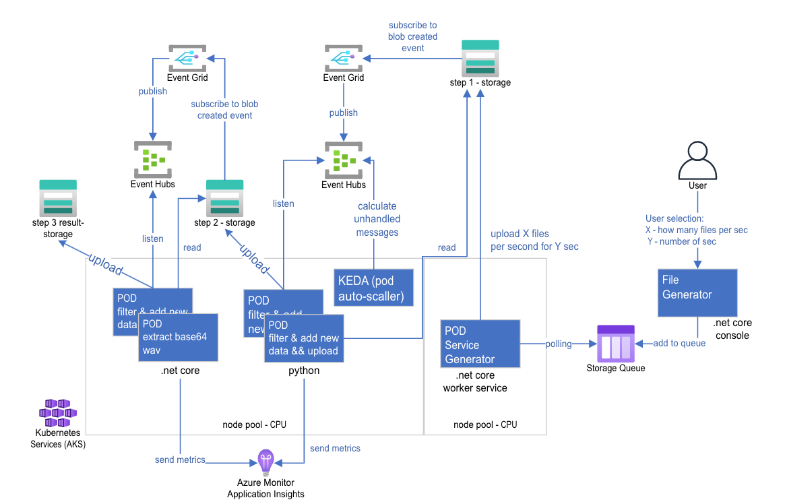

# Sample - Azure Eventer

This is a sample solution which demonstrate how to build event-based solution running on AKS with KEDA.

## Business requirements
This sample demonstrate how you can ingest high rate of new files XML files with wav file in base64 format) into Azure Storage, do several manupulation over the generated files (add new xml elements and extract the .wav file) and save the result on Azure Storage.
The KPI is to complete the end-to-end flow, from ingested time to 1st storage until getting the result to last storage in less than 4sec.

## Code components 
<B>'Service Generator'</B> - A .net core service which simulate file ingesting into Azure Storage. The service get as input the user request based on several parameters: number of files per second, simulation time
<B>'Appender Service'</B> - A Python service which listen to Azure EventHub, get the file, add several XML elements and upload the new generated file to another storage
<B>'Extractor Service'</B> - A .net core service which extract the .wav audio from the xml file and save it in result storage.

## Azure components
Azure Event Grid - responsible for the pub/sub mechanism
Azure Event Hub - data streaming platform and event ingestion service
Azure Storage - persistant storage
Azure Application Insigths - Monitor solution for application

Sample solution sketch:

